<p align="center">
  
</p>

<h1 align="center">FlatSell — Multi-Vendor Real Estate Marketplace</h1>

<p align="center">
  <strong>Bangladesh's #1 Real Estate Marketplace Platform</strong><br/>
  Browse, book, and manage apartments, villas, and land from verified companies — all in one place.
</p>

<p align="center">
  
  
  
  
  
  
  
  
</p>

---

## Table of Contents

- [Project Overview](#project-overview)
- [Core Features](#core-features)
- [Tech Stack](#tech-stack)
- [Scalability Considerations](#scalability-considerations)
- [Screenshots & Visual Walkthrough](#screenshots--visual-walkthrough)
- [Project Directory Structure](#project-directory-structure)
- [Database Schema](#database-schema)
- [API Endpoints](#api-endpoints)
- [Getting Started](#getting-started)
- [Environment Variables](#environment-variables)
- [Deployment](#deployment)

---

## Project Overview

**FlatSell** is a full-stack, multi-vendor real estate marketplace designed for the Bangladeshi property market. It connects property buyers with verified real estate companies, enabling end-to-end property discovery, unit-level booking, Stripe-powered payments, installment plans, and a complete admin back-office — all through a modern, responsive web interface.

### Core Idea

The platform operates as a **B2B2C marketplace** where:

1. **Real estate companies** (vendors) register, get verified by the Super Admin, and list their properties (apartments, villas, land).
2. **Customers** browse properties, visualize individual units on interactive floor plans, and book with a configurable booking-money percentage.
3. **Super Admin** governs the platform — approves companies, manages booking policies, tracks commissions, processes refunds, and monitors financial health.

The system enforces **three core booking policies** that are fully configurable at runtime via a singleton `PlatformSettings` document:

| Policy | Description |
|--------|-------------|
| **Policy 1 — Auto-Cancellation** | Bookings with no payment activity for *N* months (default: 3) are automatically cancelled by a daily cron job. A warning email is sent at *M* months (default: 2). |
| **Policy 2 — Voluntary Refund** | Customers may request a refund within a configurable window (default: 30 days). A retention percentage (default: 20%) is kept; the refund is debited from the vendor's wallet. |
| **Policy 3 — Booking Limits** | Configurable caps on active bookings per customer per vendor and total active bookings across all vendors, with Super Admin override capability. |

---

## Core Features

### Customer-Facing
- **Property Search & Filtering** — Search by city, filter by category (Apartment / Villa / Land), with pagination
- **Interactive Unit Visualizer** — Click individual apartment units on a floor-plan grid to view details and book
- **Villa & Land Visualizers** — Category-specific visualizations with dedicated detail schemas
- **Stripe Checkout** — Secure payment for booking money via Stripe Checkout Sessions
- **KYC Data Collection** — Per-company, per-category dynamic KYC form fields driven by `BookingPolicy`
- **Installment Plans** — Split remaining payments into 1–24 monthly installments with tiered service fees (0% / 7% / 12%) and ৳5,000 late fees
- **PDF Invoice Generation** — Automated booking confirmation and installment payment invoices via PDFKit
- **Email Notifications** — OTP verification, payment confirmations, inactivity warnings, and cancellation notices via Nodemailer

### Vendor (Company Admin) Portal
- **Multi-Step Property Wizard** — Add properties with a guided wizard (Basic Info → Category-specific Specs → Image Upload)
- **Property Management** — Edit, activate/deactivate, and manage property listings
- **Sales Reports** — View bookings, revenue, and generate PDF sales reports
- **Vendor Wallet & Ledger** — Track earnings with an append-only financial ledger
- **Custom Booking Policies** — Configure per-category KYC requirements and booking money percentages
- **Refund Management** — View and track refund requests impacting vendor wallet

### Super Admin Dashboard
- **Company Approval Workflow** — Review and approve/reject vendor applications with trade license verification
- **Margin & Commission Tracking** — Track platform commissions per booking with category-based rates
- **Policy Center** — Configure all three booking policies at runtime without code changes
- **Refund Processing** — Review, approve, and complete customer refund requests
- **Booking Limit Overrides** — Grant exceptions to booking limit rules for specific customers
- **Auto-Cancelled Bookings** — Monitor bookings cancelled by the daily inactivity cron
- **Audit Trail** — Immutable audit log of every policy action (cancellations, refunds, overrides)

### Security & Infrastructure
- **HttpOnly Cookie Authentication** — JWT tokens stored in secure, HttpOnly cookies
- **Multi-Layer Security** — Helmet, CORS, rate limiting, XSS protection, NoSQL injection prevention, HPP
- **Role-Based Access Control** — Five roles: Super Admin, Company Admin, Seller, Customer, User
- **Automated Scheduler** — In-process daily cron for booking inactivity scanning
- **Cloudinary Media Pipeline** — Optimized image uploads with auto-transformation and document storage

---

## Tech Stack

### Frontend

| Technology | Purpose |
|-----------|---------|
| **React 19** | Core UI library with hooks, lazy loading, and Suspense for code splitting |
| **Vite 8** | Lightning-fast dev server and build tool with HMR |
| **React Router 7** | Client-side routing with nested layouts, route guards, and lazy-loaded pages |
| **TailwindCSS 3** | Utility-first CSS framework for rapid, responsive UI development |
| **Axios** | HTTP client with interceptor-based auth token management and error handling |
| **React Leaflet** | Interactive map integration for property and company location display |
| **React Hot Toast** | Elegant toast notifications for user feedback |
| **React Helmet Async** | SEO-friendly dynamic `<head>` management per page |

### Backend

| Technology | Purpose |
|-----------|---------|
| **Node.js + Express 4** | RESTful API server with feature-based modular architecture |
| **Mongoose 8** | MongoDB ODM with schema validation, middleware hooks, and compound indexes |
| **MongoDB** | NoSQL document database, ideal for flexible property/unit/booking schemas |
| **Stripe** | Secure payment processing for booking money, due payments, and installments |
| **Cloudinary** | Cloud-based image/document storage with on-the-fly transformations |
| **Nodemailer** | Transactional email delivery for OTP, invoices, and notifications |
| **PDFKit** | Server-side PDF generation for invoices and sales reports |
| **JSON Web Token (JWT)** | Stateless authentication with HttpOnly cookie transport |
| **bcryptjs** | Secure password hashing with configurable salt rounds |
| **Helmet** | HTTP security headers (CSP, HSTS, X-Frame-Options, etc.) |
| **express-rate-limit** | API rate limiting (150 requests per 10-minute window) |
| **express-mongo-sanitize** | Prevention of NoSQL injection attacks |
| **xss-clean** | Cross-site scripting (XSS) attack prevention |
| **hpp** | HTTP parameter pollution protection |
| **express-validator** | Request validation and sanitization middleware |
| **Multer** | Multipart form-data parsing for file uploads |

### DevOps & Deployment

| Technology | Purpose |
|-----------|---------|
| **Vercel** | Frontend hosting with SPA rewrites and CDN distribution |
| **Render** | Backend hosting with auto-deploy, health checks, and environment management |
| **Nodemon** | Development auto-restart on file changes |
| **ESLint** | Code quality enforcement with React-specific rules |

---

## Scalability Considerations

| Concern | Current Approach | Path to Scale |
|---------|-----------------|---------------|
| **Database Indexing** | Compound indexes on frequently queried fields (status + category + city, customerId + companyId + status) | Add read replicas; shard by `companyId` or `city` for geographic distribution |
| **Feature Isolation** | Domain-driven modular structure (each feature has its own model, service, repository, controller, routes) | Easy to extract into microservices along feature boundaries |
| **Media Pipeline** | Cloudinary handles image optimization (auto-crop, quality, format) with CDN delivery | Already cloud-native; add signed uploads for large-scale deployments |
| **Payment Processing** | Stripe Checkout Sessions with webhook-ready architecture | Integrate Stripe webhooks for async payment confirmation at scale |
| **Background Jobs** | Lightweight in-process `setInterval`-based scheduler (idempotent operations) | Migrate to Bull/BullMQ with Redis for distributed job queues in multi-instance deployments |
| **Rate Limiting** | In-memory rate limiter per instance | Switch to Redis-backed rate limiting for shared state across instances |
| **Configuration** | Runtime-configurable policies via singleton `PlatformSettings` MongoDB document | Already supports hot-reload of policy values without redeployment |
| **Caching** | Direct database reads on each request | Add Redis caching layer for property listings, settings, and session data |
| **Auth Architecture** | Stateless JWT with HttpOnly cookies; Bearer token fallback | Horizontally scalable — no session server dependency |
| **Code Splitting** | React lazy loading + Suspense for all page-level components | Reduces initial bundle size; add route-level prefetching for further optimization |

---

## Screenshots & Visual Walkthrough

### 1. Homepage — Hero Section
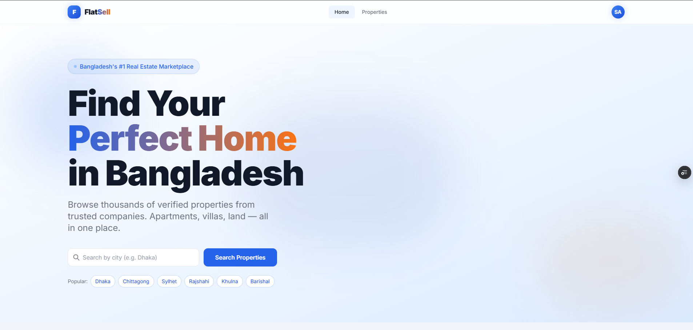

The landing page introduces FlatSell as "Bangladesh's #1 Real Estate Marketplace." It features a prominent search bar with city-based search and quick-access popular city tags (Dhaka, Chittagong, Sylhet, Rajshahi, Khulna, Barishal). The design uses bold typography with a gradient color accent to establish brand identity.

---

### 2. Homepage — Stats & Category Browser
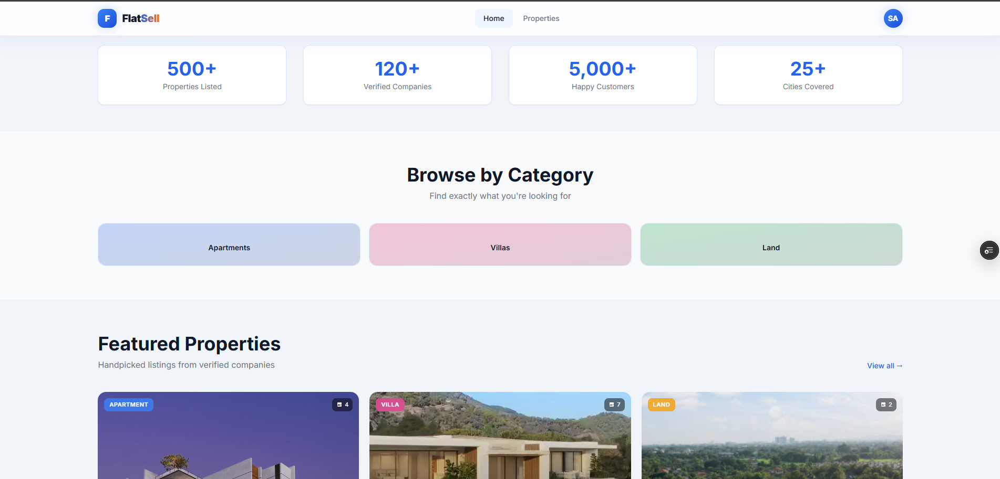

Below the hero, a statistics banner showcases platform scale (500+ Properties, 120+ Companies, 5,000+ Customers, 25+ Cities). The "Browse by Category" section provides quick navigation cards for Apartments, Villas, and Land — each with a distinct pastel-colored background for visual differentiation.

---

### 3. Homepage — Featured Properties Grid
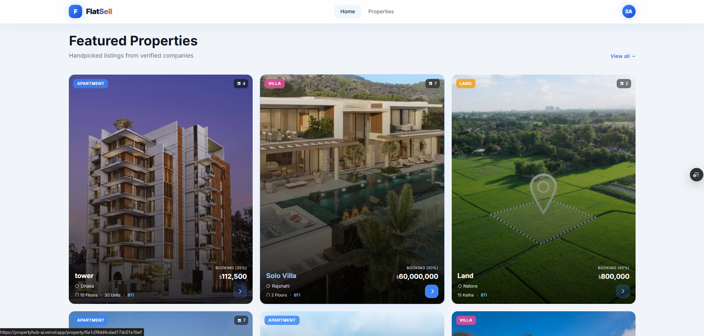

The Featured Properties section displays handpicked listings from verified companies in a responsive card grid. Each property card includes: a cover image, category badge (Apartment / Villa / Land), image count indicator, property title, location, booking percentage, price, key stats (floors, units), and the listing company. Different categories are color-coded for quick identification.

---

### 4. Property Detail — Floor Plan & Interactive Visualizer
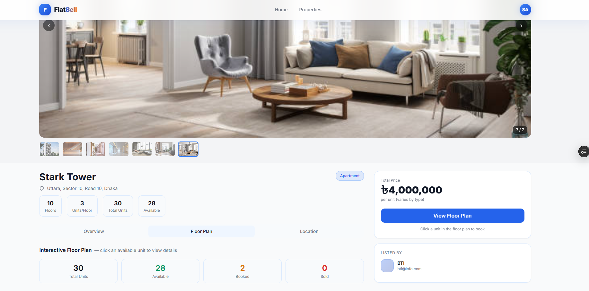

The property detail page for an apartment ("Stark Tower") shows an image carousel with gallery thumbnails, property metadata (location, type), and key stats (10 Floors, 3 Units/Floor, 30 Total Units, 28 Available). The "Floor Plan" tab reveals the interactive visualizer with unit-level statistics (Total, Available, Booked, Sold) and a sidebar showing price and the listing company.

---

### 5. Apartment Unit Visualizer — Interactive Floor Grid
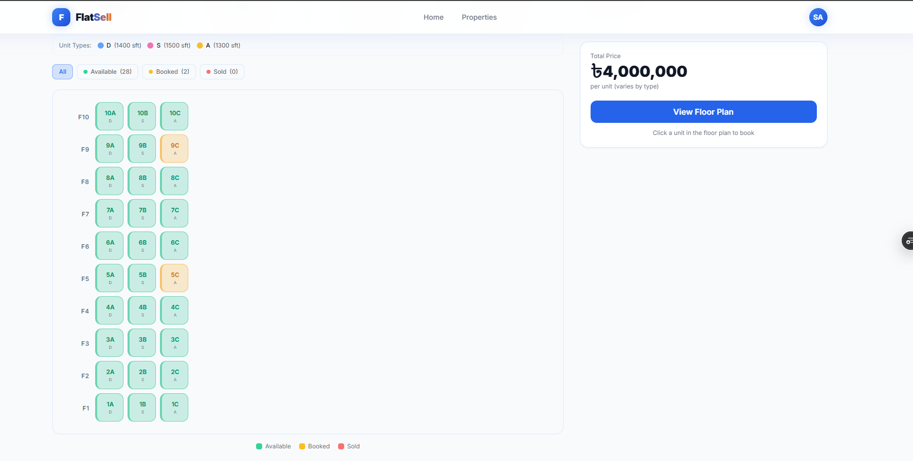

The Interactive Floor Plan renders a grid of all apartment units organized by floor (F1–F10) and column (A, B, C). Each unit cell is color-coded: **green** = Available (28), **dark green/teal** = Booked (2), **red** = Sold (0). Unit type indicators (D = 1400 sqft, S = 1500 sqft, A = 1300 sqft) are shown at the top. Clicking an available unit opens booking details with the total price displayed on the sidebar.

---

### 6. Unit Detail Modal — Apartment Unit Specs & Booking
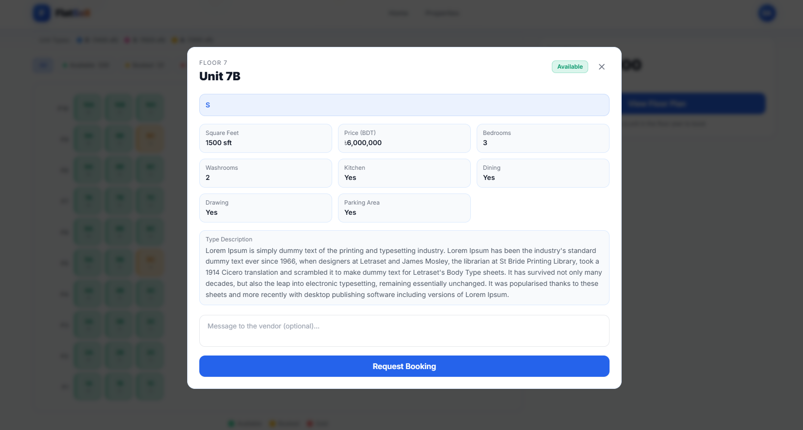

Clicking an available unit on the floor-plan grid opens a detailed modal showing the unit identity (Floor 7, Unit 7B) with an "Available" status badge. The modal displays the unit's flat type (S), complete specifications in a structured grid (Square Feet: 1500 sft, Price: ৳6,000,000, Bedrooms: 3, Washrooms: 2, Kitchen: Yes, Dining: Yes, Drawing: Yes, Parking Area: Yes), type description text, an optional message field for the vendor, and a prominent "Request Booking" CTA button.

---

### 7. Booking Checkout — Payment & Refund Policy
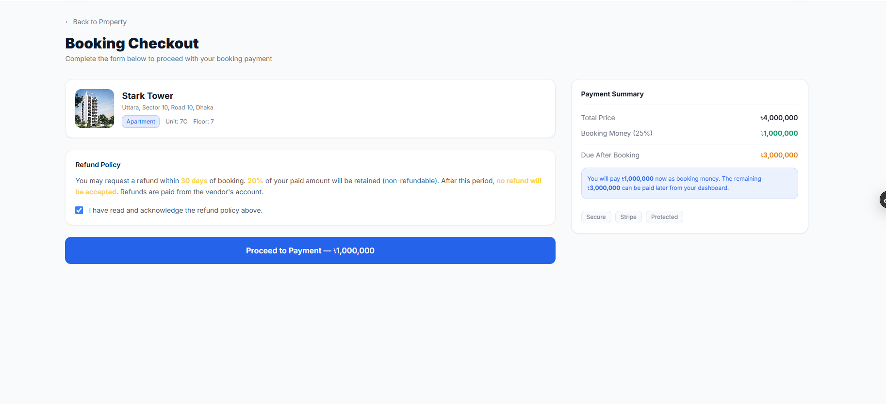

The checkout page provides a streamlined booking flow. It shows the property summary card (Stark Tower, Uttara, Apartment, Unit 7C, Floor 7), a **Refund Policy** section that the customer must acknowledge (refund within 30 days with 20% retention), and a **Payment Summary** sidebar breaking down: Total Price (৳4,000,000), Booking Money at 25% (৳1,000,000), and Due After Booking (৳3,000,000). Security badges (Secure, Stripe, Protected) reinforce trust. The "Proceed to Payment" button initiates the Stripe Checkout session.

---

### 8. Super Admin Console — Property Management
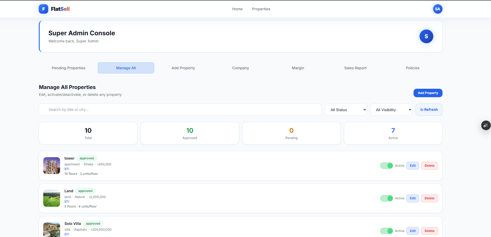

The Super Admin Console's "Manage All" tab provides full control over every property on the platform. It includes a search bar, status filter (All Status), visibility filter (All Visibility), and a refresh button. Summary stats show: 10 Total, 10 Approved, 0 Pending, 7 Active. Each property row displays a thumbnail, name, status badge, category, city, price, company, floor/unit info, and action controls — an **Active/Inactive** toggle, **Edit** button, and **Delete** button. The "Add Property" button allows the admin to create listings directly.

---

### 9. Super Admin — Platform Revenue & Margin Tracking
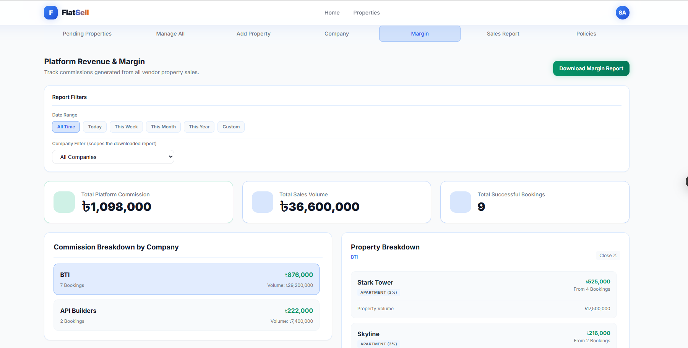

The "Margin" tab provides a comprehensive financial analytics view for the Super Admin. **Report Filters** include date range presets (All Time, Today, This Week, This Month, This Year, Custom) and a company-scoped filter. Key metrics are displayed in summary cards: Total Platform Commission (৳1,098,000), Total Sales Volume (৳36,600,000), and Total Successful Bookings (9). Below, a **Commission Breakdown by Company** panel lists each vendor (BTI: 7 bookings / ৳876,000, API Builders: 2 bookings / ৳222,000), and a **Property Breakdown** panel drills into per-property commissions with category-based percentage rates (3%). A "Download Margin Report" button exports the data as a PDF.

---

### 10. Company Admin Dashboard — Sales Report
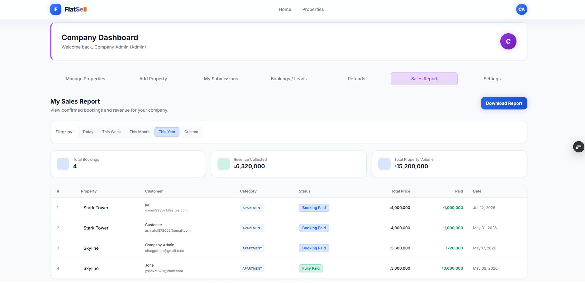

The Company Admin Dashboard's "Sales Report" tab provides vendors with a filtered view of their confirmed bookings and revenue. Time-based filters (Today, This Week, This Month, This Year, Custom) scope the data. Summary cards show: Total Bookings (4), Revenue Collected (৳6,320,000), and Total Property Volume (৳15,200,000). A detailed booking table lists each transaction with property name, customer info (name + email), category, status badge (Booking Paid / Fully Paid), total price, amount paid, and payment date. A "Download Report" button generates a PDF sales report.

---

### 11. Installment Plan Setup — Tiered Payment Scheduling
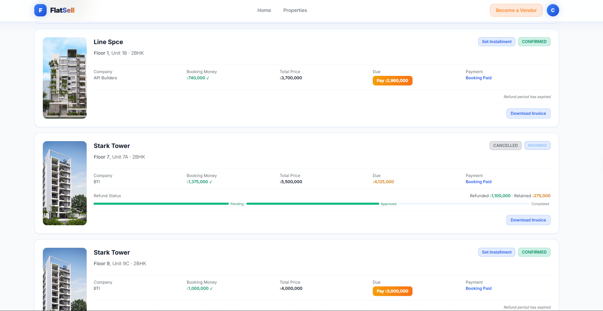

The "Set Installment Plan" modal enables customers to split their remaining due into easy monthly installments. Three policy summaries are displayed at the top: **Installment Policy** (tiered charges — 0% for 1–4, 7% for 5–12, 12% for 13–24 installments; ৳5,000 late fee; due on the 1st–15th of each month), **Refund Policy** (30-day window, 20% retention), and **Inactivity Cancellation** (2-month warning, 3-month auto-cancel, 0% refund). Financial context shows Total Price (৳3,700,000), Booking Paid (৳740,000), and Remaining Due (৳2,960,000). The installment count selector (1–24) dynamically updates a **Plan Preview** showing the tier percentage, per-installment amount, total payable, and the premium vs. lump-sum cost difference.

---

### 12. Customer Dashboard — Booking Cards & Refund Tracking
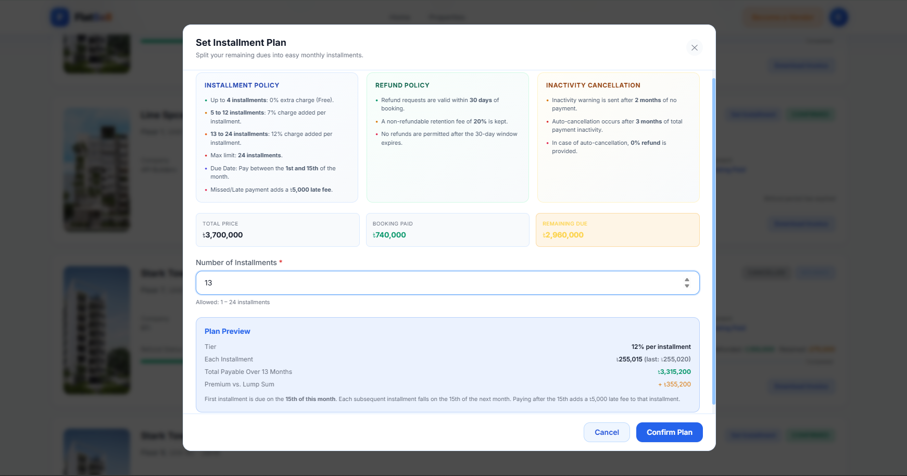

The Customer Dashboard displays all bookings as detailed cards. Each card shows the property thumbnail, unit details (floor, unit number, type), company name, booking money paid (with ✓ checkmark), total price, due amount (with a "Pay" button for outstanding balances), and payment status. A **CONFIRMED** booking shows "Set Installment" and "Download Invoice" actions. A **CANCELLED + REFUNDED** booking displays a refund progress bar (Pending → Approved → Completed) with the exact refund (৳1,100,000) and retention (৳275,000) amounts. Expired refund windows are indicated with a "Refund period has expired" label.

---

### 13. Company Admin Dashboard — Manage Properties
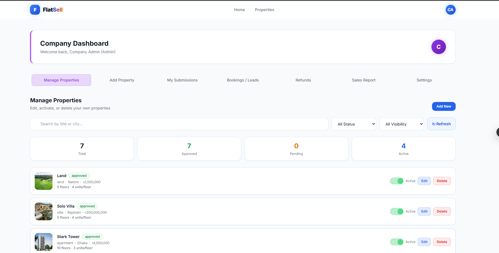

The Company Admin's "Manage Properties" tab gives vendors full control over their own property listings. It features a search bar (by title or city), status and visibility dropdown filters, and a refresh button. Summary stats display: 7 Total, 7 Approved, 0 Pending, 4 Active. Each property row shows a thumbnail image, title, approval status badge, category, city, price, floor/unit configuration, and three action controls: an **Active/Inactive** toggle switch for visibility, an **Edit** button to modify property details, and a **Delete** button to remove listings. The "Add New" button launches the multi-step property creation wizard.

---

## Project Directory Structure

### Frontend Structure

```
frontend/
├── public/
│   ├── favicon.svg                        # App favicon
│   └── icons.svg                          # SVG icon sprite
├── src/
│   ├── api/
│   │   ├── axiosInstance.js               # Axios config with interceptors & cookie credentials
│   │   ├── authApi.js                     # Auth endpoints (login, register, OTP, logout)
│   │   ├── bookingApi.js                  # Booking CRUD endpoints
│   │   ├── companyApi.js                  # Company registration & listing endpoints
│   │   ├── installmentApi.js              # Installment plan & payment endpoints
│   │   ├── policyApi.js                   # Booking policy fetch endpoints
│   │   └── propertyApi.js                 # Property CRUD & search endpoints
│   ├── assets/
│   │   └── hero.png                       # Homepage hero background image
│   ├── components/
│   │   ├── shared/
│   │   │   ├── ApartmentVisualizer.jsx    # Interactive apartment floor-plan grid
│   │   │   ├── VillaVisualizer.jsx        # Villa-specific detail visualizer
│   │   │   ├── LandVisualizer.jsx         # Land plot detail visualizer
│   │   │   ├── BookingManagement.jsx      # Shared booking list & status management
│   │   │   ├── SalesReport.jsx            # Sales report with PDF export
│   │   │   ├── PropertyCard.jsx           # Reusable property listing card
│   │   │   ├── PropertyCardSkeleton.jsx   # Loading skeleton for property cards
│   │   │   ├── Navbar.jsx                 # Global navigation with role-aware menu
│   │   │   ├── Footer.jsx                 # Site footer
│   │   │   ├── HomeHeroSection.jsx        # Homepage hero banner with search
│   │   │   ├── Layout.jsx                 # Root layout wrapper with Navbar + Footer
│   │   │   ├── LoadingScreen.jsx          # Full-page loading spinner
│   │   │   ├── Pagination.jsx             # Reusable pagination component
│   │   │   └── guards/
│   │   │       ├── GuestRoute.jsx         # Redirect authenticated users away from auth pages
│   │   │       └── ProtectedRoute.jsx     # Role-based route protection guard
│   │   ├── customer/
│   │   │   ├── BookingDetailModal.jsx     # Full booking detail modal with actions
│   │   │   ├── BookingItemCard.jsx        # Booking summary card for dashboard
│   │   │   ├── BookingLimitUsage.jsx      # Active booking limit indicator
│   │   │   ├── CheckoutForm.jsx           # KYC data collection form
│   │   │   ├── CheckoutHeader.jsx         # Checkout page header
│   │   │   ├── CheckoutPropertySummary.jsx # Property summary in checkout
│   │   │   ├── CheckoutSidebarSummary.jsx # Price breakdown sidebar
│   │   │   ├── CustomerDashboardHeader.jsx # Dashboard header with user info
│   │   │   ├── InstallmentListModal.jsx   # Installment schedule & payment modal
│   │   │   ├── PropertyAboutTab.jsx       # Property detail "About" tab
│   │   │   ├── PropertyDetailSkeleton.jsx # Loading skeleton for property detail
│   │   │   ├── PropertyHeroGallery.jsx    # Image carousel for property detail
│   │   │   ├── PropertyQuickStats.jsx     # Quick stats bar (floors, units, etc.)
│   │   │   ├── PropertySidebar.jsx        # Price & CTA sidebar
│   │   │   ├── UnitDetailModal.jsx        # Individual unit detail modal
│   │   │   └── UnitVisualizer.jsx         # Category-aware unit visualizer router
│   │   ├── companyAdmin/
│   │   │   ├── AddPropertyForm.jsx        # Full property creation form
│   │   │   ├── AddPropertyWizard.jsx      # Multi-step property wizard controller
│   │   │   ├── EditPropertyModal.jsx      # Property editing modal
│   │   │   ├── InstallmentSetupModal.jsx  # Configure installment plan for a booking
│   │   │   ├── LocationPicker.jsx         # Leaflet map location picker
│   │   │   ├── ManageProperties.jsx       # Property management table with actions
│   │   │   ├── PropertyPriceSection.jsx   # Price input section
│   │   │   ├── PropertyRequests.jsx       # Pending booking requests manager
│   │   │   ├── VendorApplicationForm.jsx  # Company registration form
│   │   │   ├── VendorPolicyModal.jsx      # Per-company policy configuration
│   │   │   ├── VendorRefunds.jsx          # Vendor-side refund tracking
│   │   │   └── wizard/
│   │   │       ├── BasicInfoStep.jsx      # Wizard Step 1: Title, category, location
│   │   │       ├── ApartmentSpecStep.jsx  # Wizard Step 2a: Flat types, floors, units
│   │   │       ├── VillaSpecStep.jsx      # Wizard Step 2b: Villa-specific details
│   │   │       ├── LandSpecStep.jsx       # Wizard Step 2c: Land-specific details
│   │   │       └── PropertyImagesStep.jsx # Wizard Step 3: Image uploads
│   │   └── superAdmin/
│   │       ├── AutoCancelledBookings.jsx  # View auto-cancelled bookings log
│   │       ├── BookingLimitOverrides.jsx  # Manage per-customer booking overrides
│   │       ├── BookingPoliciesSettings.jsx # Configure booking policies globally
│   │       ├── CompanyApproval.jsx        # Company approval / rejection workflow
│   │       ├── MarginTracking.jsx         # Commission & margin analytics dashboard
│   │       ├── PolicyCenter.jsx           # Policy management hub
│   │       ├── PolicySettings.jsx         # Platform-wide policy thresholds editor
│   │       └── RefundRequests.jsx         # Process customer refund requests
│   ├── context/
│   │   └── AuthContext.jsx                # React Context for auth state management
│   ├── data/
│   │   ├── checkout.constants.js          # KYC field definitions and labels
│   │   └── propertyOptions.js             # Category enum options
│   ├── hooks/
│   │   ├── useAddProperty.js              # Property creation logic hook
│   │   ├── useAddPropertyWizard.js        # Wizard step navigation hook
│   │   ├── useAuth.js                     # Auth context consumer shortcut
│   │   └── useUnitVisualizer.js           # Unit visualizer state management
│   ├── pages/
│   │   ├── shared/
│   │   │   ├── HomePage.jsx               # Landing page with hero, stats, featured
│   │   │   ├── PropertiesPage.jsx         # Property listing with search & filters
│   │   │   ├── PropertyDetailPage.jsx     # Full property detail with tabs
│   │   │   ├── LoginPage.jsx              # Login form with OTP flow
│   │   │   ├── RegisterPage.jsx           # Registration form
│   │   │   ├── VerifyOTPPage.jsx          # Email OTP verification
│   │   │   ├── BecomeVendorPage.jsx       # Vendor application page
│   │   │   ├── NotFoundPage.jsx           # 404 error page
│   │   │   └── UnauthorizedPage.jsx       # 403 unauthorized page
│   │   ├── customer/
│   │   │   ├── BookingCheckoutPage.jsx    # Full checkout with KYC & Stripe
│   │   │   ├── BookingSuccessPage.jsx     # Post-payment success confirmation
│   │   │   └── CustomerDashboard.jsx      # Customer bookings & installments hub
│   │   ├── companyAdmin/
│   │   │   ├── CompanyAdminDashboard.jsx  # Vendor dashboard with property overview
│   │   │   ├── MyPropertiesPage.jsx       # Property management page
│   │   │   └── SellerDashboard.jsx        # Seller-role dashboard
│   │   └── superAdmin/
│   │       └── SuperAdminDashboard.jsx    # Admin control panel with all modules
│   ├── services/                          # (Reserved for service layer abstraction)
│   ├── utils/
│   │   └── formatters.js                  # Currency & number formatting utilities
│   ├── App.jsx                            # Root app with AuthProvider wrapper
│   ├── Router.jsx                         # Route definitions with guards & lazy loading
│   ├── index.css                          # Global styles & Tailwind directives
│   └── main.jsx                           # React DOM entry point
├── index.html                             # SPA entry HTML
├── tailwind.config.js                     # Tailwind theme customization
├── postcss.config.js                      # PostCSS plugins (Tailwind, Autoprefixer)
├── vite.config.js                         # Vite build configuration
├── eslint.config.js                       # ESLint flat config for React
├── vercel.json                            # Vercel SPA rewrite rules
└── package.json                           # Frontend dependencies & scripts
```

### Backend Structure

```
backend/
├── src/
│   ├── config/
│   │   └── cloudinary.js                  # Cloudinary SDK config + Multer storage engines
│   ├── database/
│   │   ├── db.js                          # MongoDB connection with auto-reconnect
│   │   ├── check.js                       # DB connectivity check utility
│   │   ├── checkBookings.js               # Booking data integrity checker
│   │   ├── migratePolicies.js             # Policy migration script
│   │   └── seed-platform-company.js       # Platform company seeder
│   ├── errors/
│   │   └── index.js                       # Custom error classes (NotFound, Validation, Forbidden, Conflict)
│   ├── features/
│   │   ├── shared/                        # Cross-role features
│   │   │   ├── auth/
│   │   │   │   ├── user.model.js          # User schema (multi-role, OTP, bcrypt)
│   │   │   │   ├── auth.controller.js     # Auth request handlers
│   │   │   │   ├── auth.service.js        # Auth business logic (register, login, OTP)
│   │   │   │   ├── auth.repository.js     # User data access layer
│   │   │   │   └── auth.routes.js         # Auth API routes
│   │   │   ├── properties/
│   │   │   │   ├── property.model.js      # Property schema (apartment/villa/land polymorphic)
│   │   │   │   ├── property.controller.js # Property request handlers
│   │   │   │   ├── property.service.js    # Property CRUD & search logic
│   │   │   │   ├── property.repository.js # Property data access layer
│   │   │   │   └── property.routes.js     # Property API routes
│   │   │   ├── units/
│   │   │   │   ├── unit.model.js          # Unit schema (floor, status, type, pricing)
│   │   │   │   ├── unit.controller.js     # Unit request handlers
│   │   │   │   ├── unit.service.js        # Unit CRUD logic
│   │   │   │   ├── unit.repository.js     # Unit data access layer
│   │   │   │   └── unit.routes.js         # Unit API routes
│   │   │   ├── bookings/
│   │   │   │   ├── booking.model.js       # Booking schema (status, payment, KYC, Stripe, installments, refund)
│   │   │   │   ├── booking.controller.js  # Booking request handlers
│   │   │   │   ├── booking.service.js     # Booking lifecycle (create, confirm, pay, cancel, report)
│   │   │   │   ├── booking.repository.js  # Booking data access layer
│   │   │   │   ├── booking.routes.js      # Booking API routes
│   │   │   │   └── bookingLimits.service.js # Policy 3 — booking limit enforcement
│   │   │   ├── companies/
│   │   │   │   ├── company.model.js       # Company schema (status, wallet, trade license)
│   │   │   │   ├── company.controller.js  # Company request handlers
│   │   │   │   ├── company.service.js     # Company CRUD & approval logic
│   │   │   │   ├── company.repository.js  # Company data access layer
│   │   │   │   └── company.routes.js      # Company API routes
│   │   │   ├── policies/
│   │   │   │   ├── bookingPolicy.model.js # Per-company, per-category KYC policy schema
│   │   │   │   ├── bookingPolicy.controller.js
│   │   │   │   ├── bookingPolicy.service.js
│   │   │   │   ├── bookingPolicy.repository.js
│   │   │   │   ├── bookingPolicy.routes.js
│   │   │   │   ├── policy.model.js        # Global policy schema
│   │   │   │   ├── policy.controller.js
│   │   │   │   ├── policy.service.js
│   │   │   │   ├── policy.repository.js
│   │   │   │   └── policy.routes.js
│   │   │   ├── audit/
│   │   │   │   ├── auditLog.model.js      # Immutable audit trail schema
│   │   │   │   ├── audit.service.js       # Audit logging service
│   │   │   │   └── audit.repository.js    # Audit data access layer
│   │   │   └── overrides/
│   │   │       └── bookingLimitOverride.model.js # Per-customer booking limit exceptions
│   │   ├── admin/                         # Super Admin features
│   │   │   ├── dashboard/
│   │   │   │   ├── admin.controller.js    # Admin dashboard handlers
│   │   │   │   ├── admin.service.js       # Dashboard aggregation logic
│   │   │   │   ├── admin.repository.js    # Admin data access layer
│   │   │   │   └── admin.routes.js        # Admin API routes
│   │   │   ├── commissions/
│   │   │   │   ├── commission.model.js    # Commission tracking schema
│   │   │   │   ├── commission.controller.js
│   │   │   │   ├── commission.service.js  # Commission calculation & payout logic
│   │   │   │   ├── commission.repository.js
│   │   │   │   └── commission.routes.js
│   │   │   ├── refunds/
│   │   │   │   ├── refundRequest.model.js # Refund request schema (Policy 2)
│   │   │   │   ├── refund.controller.js   # Refund processing handlers
│   │   │   │   ├── refund.service.js      # Refund workflow & wallet debit logic
│   │   │   │   ├── refund.repository.js   # Refund data access layer
│   │   │   │   └── refund.routes.js       # Refund API routes
│   │   │   └── settings/
│   │   │       ├── platformSettings.model.js # Singleton global settings schema
│   │   │       ├── platformSettings.controller.js
│   │   │       ├── platformSettings.service.js
│   │   │       ├── platformSettings.repository.js
│   │   │       └── platformSettings.routes.js
│   │   ├── customer/                      # Customer-specific features
│   │   │   ├── checkout/
│   │   │   │   ├── checkout.controller.js # Stripe session creation handlers
│   │   │   │   ├── checkout.service.js    # Checkout flow with KYC, policy, and Stripe
│   │   │   │   ├── checkout.repository.js # Checkout data access layer
│   │   │   │   └── checkout.routes.js     # Checkout API routes
│   │   │   └── installments/
│   │   │       ├── installment.model.js   # Installment schedule schema (1–24 months)
│   │   │       ├── installment.controller.js
│   │   │       ├── installment.service.js # Installment generation, payment, & late fees
│   │   │       ├── installment.repository.js
│   │   │       └── installment.routes.js
│   │   └── vendor/                        # Vendor-specific features
│   │       └── vendorLedger/
│   │           └── vendorLedger.model.js  # Append-only wallet transaction ledger
│   ├── jobs/
│   │   ├── scheduler.js                   # Daily cron scheduler (auto-cancel scan)
│   │   └── autoCancelInactiveBookings.js  # Policy 1 implementation — inactivity scanner
│   ├── middleware/
│   │   ├── auth.middleware.js             # JWT verification (protect) & RBAC (authorize)
│   │   └── error.middleware.js            # Global error handler with structured responses
│   ├── responses/
│   │   └── index.js                       # Standardized API response helpers
│   ├── utils/
│   │   ├── sendEmail.js                   # Email templates (OTP, confirmations, warnings)
│   │   ├── generateInvoicePDF.js          # Booking payment invoice PDF generator
│   │   ├── generateInstallmentInvoicePDF.js # Installment payment invoice PDF generator
│   │   ├── generateReportPDF.js           # Sales report PDF generator
│   │   ├── generateOTP.js                 # 6-digit OTP generator
│   │   └── dateUtils.js                   # Date arithmetic utilities
│   ├── app.js                             # Express app setup (middleware, routes, error handling)
│   └── server.js                          # Server entry point (DB connect, start scheduler)
├── .env                                   # Environment variables (not committed)
├── .npmrc                                 # npm configuration
├── render.yaml                            # Render deployment blueprint
└── package.json                           # Backend dependencies & scripts
```

---

## Database Schema

The platform uses **10 Mongoose models** organized across the feature modules:

```
┌─────────────────────────────────────────────────────────────────────┐
│                         MongoDB Collections                         │
├─────────────────┬───────────────────────────────────────────────────┤
│ User            │ Multi-role users (Super Admin, Company Admin,     │
│                 │ Seller, Customer). Email-verified via OTP.        │
├─────────────────┼───────────────────────────────────────────────────┤
│ Company         │ Verified vendor companies with wallet balance,    │
│                 │ trade license, and approval workflow.             │
├─────────────────┼───────────────────────────────────────────────────┤
│ Property        │ Polymorphic listings — apartments (with flat      │
│                 │ types), villas, and land plots. Geo-located.      │
├─────────────────┼───────────────────────────────────────────────────┤
│ Unit            │ Individual bookable units within a property       │
│                 │ (floor + unit number, status, pricing).           │
├─────────────────┼───────────────────────────────────────────────────┤
│ Booking         │ Central transaction record linking customer,      │
│                 │ property, unit, and company. Tracks payment       │
│                 │ status, KYC, Stripe sessions, and refund state.   │
├─────────────────┼───────────────────────────────────────────────────┤
│ Installment     │ Pre-generated monthly payment schedule (1–24).    │
│                 │ Tiered extra charges and ৳5,000 late fees.        │
├─────────────────┼───────────────────────────────────────────────────┤
│ Commission      │ Platform commission per booking (per-category     │
│                 │ percentage-based earnings tracking).              │
├─────────────────┼───────────────────────────────────────────────────┤
│ BookingPolicy   │ Per-company, per-category KYC requirements and    │
│                 │ booking money percentage configuration.           │
├─────────────────┼───────────────────────────────────────────────────┤
│ PlatformSettings│ Singleton global configuration for all policy     │
│                 │ thresholds (inactivity, refund window, limits).   │
├─────────────────┼───────────────────────────────────────────────────┤
│ RefundRequest   │ Voluntary refund records with retention split     │
│                 │ and approval workflow.                            │
├─────────────────┼───────────────────────────────────────────────────┤
│ VendorLedger    │ Append-only financial ledger for vendor wallet    │
│                 │ transactions (credits, refund debits).            │
├─────────────────┼───────────────────────────────────────────────────┤
│ AuditLog        │ Immutable trail of all policy actions with        │
│                 │ actor, target, and metadata.                      │
├─────────────────┼───────────────────────────────────────────────────┤
│ BookingLimit    │ Per-customer override exceptions for booking      │
│ Override        │ limit policies.                                   │
└─────────────────┴───────────────────────────────────────────────────┘
```

---

## API Endpoints

| Prefix | Module | Description |
|--------|--------|-------------|
| `GET /api/health` | Health | Service health check |
| `/api/auth` | Auth | Register, login, logout, OTP verify, get current user |
| `/api/properties` | Properties | CRUD, search, filter, approve/reject |
| `/api/units` | Units | List/update units for a property |
| `/api/bookings` | Bookings | Create, list, confirm/reject, cancel, pay due, generate invoices |
| `/api/checkout` | Checkout | Stripe checkout session creation with KYC |
| `/api/booking-policies` | Booking Policies | Per-company KYC & booking % configuration |
| `/api/policies` | Global Policies | Platform-wide policy display |
| `/api/companies` | Companies | Register, list, approve/reject companies |
| `/api/commissions` | Commissions | Commission tracking & margin analytics |
| `/api/installments` | Installments | Setup plans, pay installments, view schedule |
| `/api/settings` | Platform Settings | Read/update global policy thresholds |
| `/api/refunds` | Refunds | Request, approve, complete refund workflows |
| `/api/admin` | Admin Dashboard | Dashboard stats, auto-cancelled bookings, overrides |

---

## Getting Started

### Prerequisites

- **Node.js** ≥ 18.x
- **MongoDB** (local or MongoDB Atlas)
- **Stripe** account with API keys
- **Cloudinary** account for media storage
- **Email** SMTP credentials (Gmail App Password or similar)

### Installation

```bash
# Clone the repository
git clone https://github.com/your-username/propertyhub-ai.git
cd propertyhub-ai

# Install backend dependencies
cd backend
npm install

# Install frontend dependencies
cd ../frontend
npm install
```

### Running Locally

```bash
# Terminal 1 — Start the backend (port 5000)
cd backend
npm run dev

# Terminal 2 — Start the frontend (port 5173)
cd frontend
npm run dev
```

The frontend will be available at `http://localhost:5173` and the API at `http://localhost:5000`.

---

## Environment Variables

### Backend (`backend/.env`)

```env
# Server
NODE_ENV=development
PORT=5000

# Database
MONGO_URI=mongodb+srv://<user>:<password>@cluster.mongodb.net/flatsell

# Authentication
JWT_SECRET=your-jwt-secret-key
JWT_EXPIRES_IN=7d
COOKIE_SECRET=your-cookie-secret

# Frontend URL (for CORS)
CLIENT_URL=http://localhost:5173

# Email (Nodemailer)
EMAIL_USER=your-email@gmail.com
EMAIL_PASS=your-app-password

# Cloudinary
CLOUDINARY_CLOUD_NAME=your-cloud-name
CLOUDINARY_API_KEY=your-api-key
CLOUDINARY_API_SECRET=your-api-secret

# Stripe
STRIPE_SECRET_KEY=sk_test_your-stripe-secret-key
```

### Frontend (`frontend/.env`)

```env
VITE_API_URL=http://localhost:5000/api
```

---

## Deployment

### Frontend — Vercel

The frontend is configured for Vercel with SPA rewrites in `vercel.json`:

```json
{
  "version": 2,
  "rewrites": [{ "source": "/(.*)", "destination": "/index.html" }]
}
```

### Backend — Render

The backend deploys to Render using the `render.yaml` blueprint with:
- Auto-deploy from the `backend/` directory
- Health check at `/api/health`
- Environment variables for all secrets

---

<p align="center">
  Built with care for the Bangladeshi real estate market<br/>
  <strong>FlatSell</strong> — Find Your Perfect Home in Bangladesh
</p>
